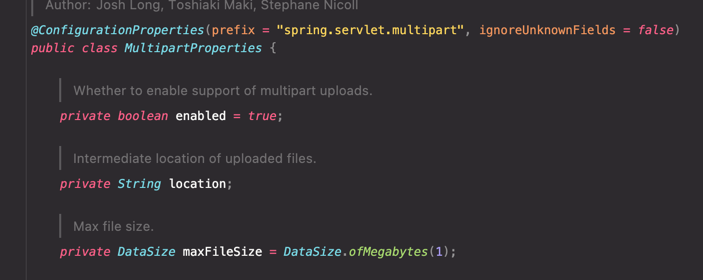
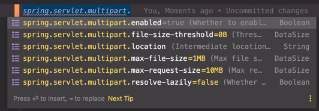

# 스프링부트 기반 간단한 파일 업로드 서버

파일을 업로드, 다운로드하는 서버를 구현

### 파일 업로드

Multipart 요청을 받아서 업로드

MultipartFile -> 파일 업로드시 사용하는 MethodArgument   
MultipartFile을 위한 MethodArgument는 MultipartResolver 빈이 등록되어 있어야한다.   
(DispatcherServlet안에 MultipartResolver가 등록되어있어야한다.)

---
### DispatcherServlet에서 Resolver등록
DispatcherServlet 내부에서 MultipartResolver를 등록하는 코드


---
### MultipartAutoConfiguration
MultipartProperties 와 MultipartResolver에 대한 자동 설정을 하는 MultipartAutoConfiguration(Springboot의 자동설정)

---
### MultipartProperties

MultipartProperties 클래스를 참고하면 multipart 요청에 관한 설정에 어떤것을 할 수 있는지 알 수 있다.   
properties 파일에는 ```spring.servlet.multipart.설정옵션```으로 설정이 가능하다.





---
### 업로드 기능 추가

```java
@Controller
public class FileController {

    private final FileService fileService;

    public FileController(FileService fileService) {
        this.fileService = fileService;
    }

    // 파일 업로드 Form 페이지로 이동
    @GetMapping("/files")
    public String fileUploadForm(Model model) {
        return "files/index";
    }

    // 파일 업로드, fileService.fileUpload(file) 호출
    // MultipartFile 로 요청의 파일을 바인딩한다.
    // FlashAttribute로 리다이렉트 된곳에 사용하고 삭제되는 세션에 파일이름을 담아 함께 보낸다.
    @PostMapping("/files")
    public String fileUpload(@RequestBody MultipartFile file, RedirectAttributes attributes) {
        attributes.addFlashAttribute("filename", fileService.fileUpload(file));
        return "redirect:/files";
    }
}

@Service
public class FileService {

    // 파일이 저장되는 경로
    private static final String FILE_PATH = "src/main/resources/file";

    // 파일을 업로드
    public String fileUpload(MultipartFile file) {
        Path path = Paths.get(FILE_PATH).toAbsolutePath().normalize();
        String filename = file.getOriginalFilename();
        Path targetPath = path.resolve(filename).normalize();
        try {
            file.transferTo(targetPath);
        } catch (IOException e) {
            throw new IllegalArgumentException("파일 업로드에 실패했습니다.");
        }
        return filename;
    }
    // nomalize() 메서드 - 파일 경로에서 중복된 요소를 제거한다. 
    // 많은 파일 시스템에서 "." 및 ".."는 현재 디렉토리와 상위 디렉토리를 나타내는 데 사용되는 특수 이름이다.
    // 만약 ".." 앞에 파일 경로가 있다면 중복된 요소로 판단한다. 다음 예시를 보자
    // "/file/image/.."
    // "/file"
    // 따라서 nomalize() 메서드는 /image/.. 가 중복된 요소라 판단, 해당 요소를 제거한다.
}
```

### 파일 다운로드 기능 추가

파일 리소스 읽어오는법 : 스프링의 Resource Loader 사용하기
* 리소스를 읽어오는 기능을 제공
* 파일 시스템에서 읽어오기
* 클래스 패스에서 읽어오기
* URL로 읽어오기
* 상대/절대 경로로 읽어오기

파일 다운로드의 응답 헤더에 설정할 내용
* Content-Disposition : 사용자가 해당 파일을 다운받을 때 사용할 파일이름
  * 헤더 값으로 다음의 값을 사용 "attachment; filename=[파일이름]" 여기서 [파일이름]은 사용자가 받는 파일의 이름이 된다.
  * 예를들어 "attachment; filename=cat.jpeg" 라면 사용자는 cat.jpeg라는 이름으로 저장한다. 
* Content-Type : 어떤 타입의 파일인가 ex) image/jpg
* Content-Length : 파일의 크기

파일의 MediaType을 알아내는 방법 (Content-Type에 사용할 수 있음)   
[Tika](http://tika.apache.org)

```java
Tika tika = new Tika();
String mediaType = tika.detect(file);
```

Tick 객체는 빈으로 등록해서 사용해도됨.


```java
    // 파일 다운로드 폼 (파일 이름을 입력해서 다운로드 받음)
    @GetMapping("/file")
    public String fileDownloadForm() {
        return "files/download";
    }

    // 파일 다운로드 api
    @GetMapping("/file/download")
    public ResponseEntity<Resource> fileDownload(@RequestParam String filename) throws IOException {
        Resource resource = fileService.fileDownload(filename);
        File file = resource.getFile();

        // Tika를 사용해서 파일의 MediaType을 알아낸다
        Tika tika = new Tika();
        String mediaType = tika.detect(file);
        
        // 파일 다운로드를 위한 헤더와 본문에 파일을 넣어서 응답
        return ResponseEntity.ok()
                .header(HttpHeaders.CONTENT_DISPOSITION, "attachment; filename:\"" + resource.getFilename() + "\"")
                .header(HttpHeaders.CONTENT_TYPE, mediaType)
                .header(HttpHeaders.CONTENT_LENGTH, String.valueOf(file.length()))
                .body(resource);
    }

@Service
public class FileService {
    private static final String FILE_DOWNLOAD_PATH = "classpath:/file/";

    // 파일 리소스를 가져오기 위한 ResourceLoader 가져오기 (스프링의 ResourceLoader)
    private final ResourceLoader resourceLoader;

    public FileService(ResourceLoader resourceLoader) {
        this.resourceLoader = resourceLoader;
    }

    // 파일 업로드 생략

    // 경로로 리소스를 찾아온다
    public Resource fileDownload(String filename) {
        return resourceLoader.getResource(FILE_DOWNLOAD_PATH + filename);
    }
}
```

### Resource 추상화

앞서 파일 다운로드에서 ResourceLoader 를 사용해서 Resource를 가져올 수 있었다.

스프링에서는 Resource를 추상화 시켰는데 이것은 java.net.URL을 추상화한 것이다.   
기존의 자바에서는 classpath를 기준으로 파일을 가져오려면 호출이 조금 복잡했다.

```java
// classpath를 구하려면 다음과 같은 방식을 거쳐야한다.
File(this.getClass().getProtectionDomain().getCodeSource().getLocation().getPath()).getAbsolutePath()
```

스프링에서 Resource를 추상화한 이유가 여기에 있다.
* classpath 기준으로 리소스를 읽어오는 기능 부재
* ServletContext를 기준으로 리소스를 읽어오는 기능 부재
* 새로운 핸들러를 등록하여 특별한 URL 접미사를 만들어 사용할 수는 있지만 구현이 복잡하고 편의성 메서드가 부족

스프링 내부 구현에 많이 사용되고 있는 인터페이스다.   
예를들어 xml 파일을 가지고 애플리케이션 컨텍스트를 만들때 xml 파일을 가져오는 역할을 Resource 인터페이스 구현체의 객체가 담당한다.

```java
new ClassPathXmlApplicationContext("xml이름.xml");
// 내부적으로 Resource가 명시한 파일이름을 찾아 리소스를 가져온다.
```