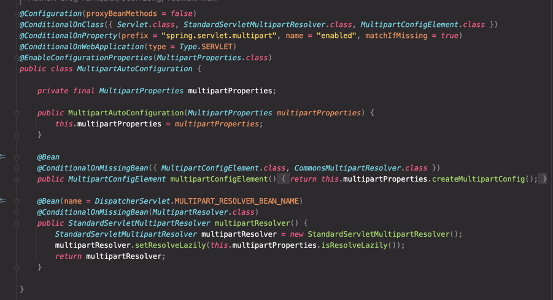

# 스프링부트 기반 간단한 파일 업로드 서버

파일을 업로드, 다운로드하는 서버를 구현

### 파일 업로드

Multipart 요청을 받아서 업로드

MultipartFile -> 파일 업로드시 사용하는 MethodArgument   
MultipartFile을 위한 MethodArgument는 MultipartResolver 빈이 등록되어 있어야한다.   
(DispatcherServlet안에 MultipartResolver가 등록되어있어야한다.)

---
### DispatcherServlet에서 Resolver등록
DispatcherServlet 내부에서 MultipartResolver를 등록하는 코드


---
### MultipartAutoConfiguration
MultipartProperties 와 MultipartResolver에 대한 자동 설정을 하는 MultipartAutoConfiguration(Springboot의 자동설정)

---
### MultipartProperties

MultipartProperties 클래스를 참고하면 multipart 요청에 관한 설정에 어떤것을 할 수 있는지 알 수 있다.   
properties 파일에는 ```spring.servlet.multipart.설정옵션```으로 설정이 가능하다.


---
### 업로드 기능 추가

```java
@Controller
public class FileController {

    private final FileService fileService;

    public FileController(FileService fileService) {
        this.fileService = fileService;
    }

    // 파일 업로드 Form 페이지로 이동
    @GetMapping("/files")
    public String fileUploadForm(Model model) {
        return "files/index";
    }

    // 파일 업로드, fileService.fileUpload(file) 호출
    // MultipartFile 로 요청의 파일을 바인딩한다.
    // FlashAttribute로 리다이렉트 된곳에 사용하고 삭제되는 세션에 파일이름을 담아 함께 보낸다.
    @PostMapping("/files")
    public String fileUpload(@RequestBody MultipartFile file, RedirectAttributes attributes) {
        attributes.addFlashAttribute("filename", fileService.fileUpload(file));
        return "redirect:/files";
    }
}

@Service
public class FileService {

    // 파일이 저장되는 경로
    private static final String FILE_PATH = "src/main/resources/file";

    // 파일을 업로드
    public String fileUpload(MultipartFile file) {
        Path path = Paths.get(FILE_PATH).toAbsolutePath().normalize();
        String filename = file.getOriginalFilename();
        Path targetPath = path.resolve(filename).normalize();
        try {
            file.transferTo(targetPath);
        } catch (IOException e) {
            throw new IllegalArgumentException("파일 업로드에 실패했습니다.");
        }
        return filename;
    }
    // nomalize() 메서드 - 파일 경로에서 중복된 요소를 제거한다. 
    // 많은 파일 시스템에서 "." 및 ".."는 현재 디렉토리와 상위 디렉토리를 나타내는 데 사용되는 특수 이름이다.
    // 만약 ".." 앞에 파일 경로가 있다면 중복된 요소로 판단한다. 다음 예시를 보자
    // "/file/image/.."
    // "/file"
    // 따라서 nomalize() 메서드는 /image/.. 가 중복된 요소라 판단, 해당 요소를 제거한다.
}
```


